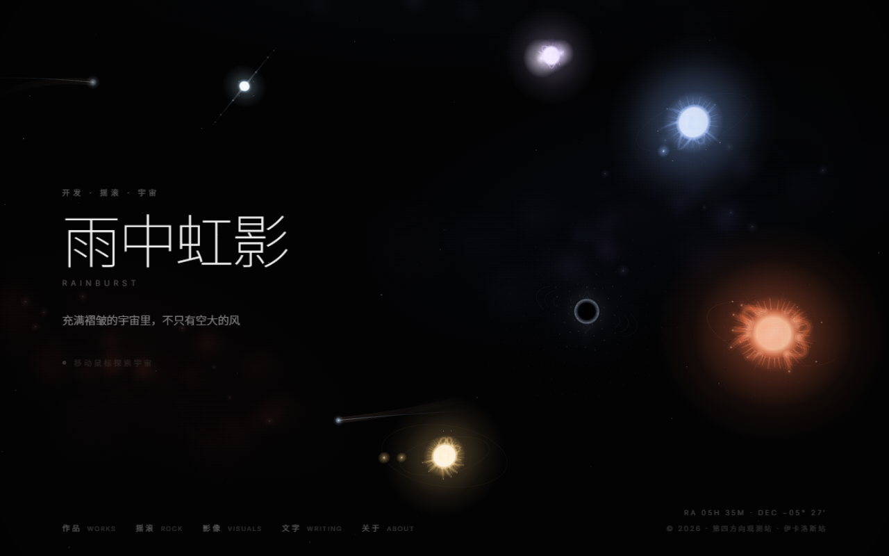
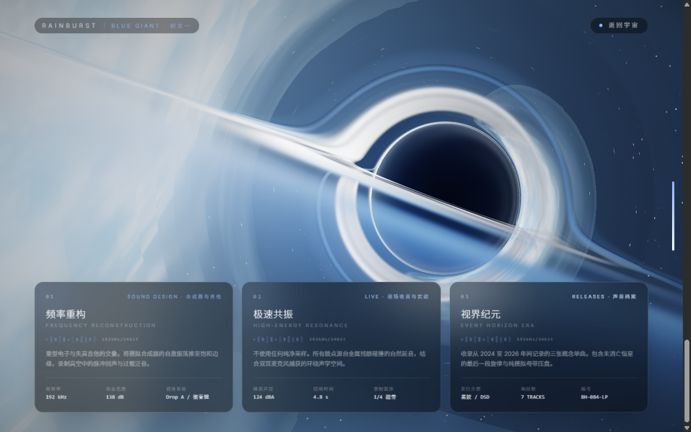

# 雨中虹影 · Interactive Black Hole Universe

> 一个把整个个人网站做成可交互黑洞的尝试：移动鼠标，你将成为一个大质量黑洞。

**在线地址：** <https://rainburst.cc>



---

## 这是什么

这不是一份普通的作品集，而是一片你亲手操控的宇宙。

- 你的鼠标就是一个**大质量黑洞**。划过屏幕时，它会实时弯曲背景的星空点阵、把引力透镜的光晕拖到身后、沿途吸积漂浮的彗星与尘埃。
- 宇宙里悬着**五颗恒星**，分别代表网站的五个板块——蓝巨星（摇滚）、红巨星（影像）、黄矮星（文字）、中子星（关于）、双星系统（作品）。把黑洞拖到某颗星附近，会触发挥视界吞噬动画，随后跳转进对应板块页。
- 其中**「摇滚」板块**走的是一个完全独立设计的黑洞电影页：滚动进度驱动相机从远景一路推进到卡冈图雅特写，看着一颗蓝巨星的大气被潮汐力一层层撕碎、汇入吸积盘。



---

## 技术亮点

- **零依赖黑洞着色器** — [`src/universe/blackhole.ts`](./src/universe/blackhole.ts) 用原生 WebGL2 + GLSL，逐像素积分史瓦西测地线，引力透镜、光子环、吸积盘湍流、多普勒集束都是真实模拟出来的。没有引 three.js，因此单文件构建产物仍然只有 **313 KB**。

- **黑洞引擎参数化** — 盘面色温、终局机位、潮汐流颜色这些全部从 [`src/data/site.ts`](./src/data/site.ts) 的恒星数据派生。未来红巨星、中子星等板块复用同一个引擎，只需换一套预设：红巨星=橙红盘+侧俯视角，中子星=青白窄盘+极俯视角。

- **CPU 参考实现做测试** — [`selftest/bh-shader.mjs`](./selftest/bh-shader.mjs) 是那段 GLSL 逐行移植出来的零依赖 JavaScript 版本，配套 5 个自检脚本，直接 `node` 就能跑，**不需要浏览器**，用来做无回归出图和采样质量分析。

- **全站文案集中可调** — 想改名字、slogan、板块名、卡片文案，只动 [`src/data/site.ts`](./src/data/site.ts) 一个文件即可。

---

## 快速开始

```bash
# 1. 安装依赖（需要 Node ≥ 20）
npm install

# 2. 本地开发，热更新
npm run dev            # 打开 http://localhost:5173
#    或者在 Windows 上直接双击 启动网站.bat

# 3. 构建单文件成品
npm run build          # 产物 dist/index.html，双击即可离线打开
npm run preview        # 本地预览构建产物
```

---

## 自检脚本（可选）

先把 TypeScript 引擎转译成可被 `node` 直接 import 的 ESM，再逐个跑自检：

```bash
npx esbuild src/universe/engine.ts src/universe/blackhole.ts src/data/site.ts \
  --format=esm --outdir=dist-selftest

node selftest/harness.mjs         # 宇宙引擎：图层绘制、状态栈配平、彗尾脱轨检测
node selftest/comet-physics.mjs   # 彗星引力偏折的物理不变量
node selftest/test-blackhole.mjs  # 黑洞场景架构与卡片数据完整性
node selftest/alias-check.mjs     # 着色器锯齿 / 摩尔纹量化
```

跑图工具（离线渲染黑洞各个滚动进度，看构图用）：

```bash
node selftest/render-blackhole.mjs 0,0.5,1 320   # 输出 selftest/bh-p<NN>.png
```

---

## 目录结构

```
src/
├─ App.tsx                # 板块路由：blue-giant 走黑洞电影页，其余走通用页
├─ components/
│  ├─ CosmosView.tsx      # 首页宇宙视图（Canvas 2D 引擎挂载）
│  ├─ BlueGiantPage.tsx   # 「摇滚」黑洞电影页（滚动编排 + 覆盖层 UI）
│  └─ SectionPage.tsx     # 通用板块页
├─ universe/
│  ├─ engine.ts           # Canvas 2D 宇宙引擎（点阵、恒星、吞噬动画）
│  └─ blackhole.ts        # WebGL2 黑洞渲染（测地线光线步进着色器）
├─ data/
│  └─ site.ts             # 全站可调文案与恒星参数
└─ utils/
selftest/                 # CPU 着色器参考实现 + 零依赖自检脚本
```

---

## 部署

GitHub 推送到 `main` → Cloudflare Pages 自动构建（Build command `npm run build`，输出目录 `dist`）→ 自定义域名 <https://rainburst.cc>。

---

## 版权

© 2026 雨中虹影 · 保留所有权利。
